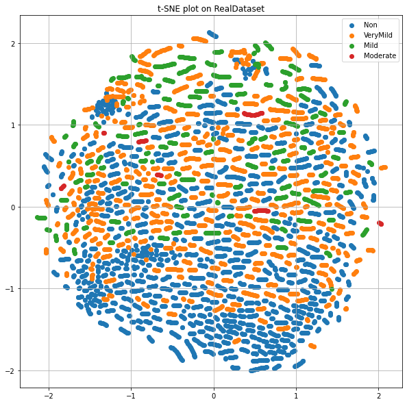

# Synthetic Health Data Hackathon 2020
Participated in the recognition of Alzheimer's on synthetic MRI images with [Nikita Baranov](https://www.linkedin.com/in/nbar/) and [Anastasia Tabalina](https://github.com/TabalinaAnastasia).

Link to hackathon: [link](https://rh.biolib.com/event/synthetic-health-data-2020/) 
Originaly posted: [link](https://biolib.com/Gardariki-Hack/Gardariki-Hack/)

[solution.ipynb](solution.ipynb) - train / val models; 
[shap.ipynb](shap.ipynb) - models interpretation; 
[t-sne.ipynb](t-sne.ipynb) - data visualization.

# Our solution
At this hackathon, we decided to take part in the Alzheimer's MRI Image Analysis task,
which was considered in a binary setting, which means we join all Alzheimer's subclasses into one class.

## Problem statement and data pre-processing
We considered the problem in three formulations:
- train and validate a model on synthetic data;
- train and validate a model on real data;
- train a model on synthetic data and validate on real data.

## NN architectures: CustomCNN, ResNet
To solve the problem, we used convolutional neural networks, namely two architectures: Custom CNN model; Resnet18 model, which is the smallest version of the architecture in terms of the number of parameters, in pretrained and non-pretrained versions.

All the following metrics were obtained on the latest version of the dataset.

We solved the synthetic train / synthetic validation task using custom CNN model, and got 99.1% accuracy on validation. The best result on real train / real validation task was obtained using non-pretrained resnet18 (custom CNN and pretrained resnet18 gave worse results). The final metrics are 97.8% accuracy and 98% f1-score on validation. For synthetic train / real validation task we could achieved 64.8% accuracy and 64% f1-score on validation using non-pretrained resnet18 model while metrics on train dataset are 99.8% accuracy and 100% f1-score.

 
*Pic.1. Model scores.*

## What is the reason for this difference in metrics?
We decided to look at the structure of our data. Since they are presented in multidimensional space, we used PCA + t-SNE to visualize the data in two-dimensional space and got the following results on the slide.

 
*Pic.2.1. t-SNE visualization (synthetic dataset).*

 
*Pic.2.2. t-SNE visualization (real dataset).*

As you can see, the structure of synthetic data is quite simple (cluttered, in comparison with real data).

## Find the most important regions of the brain for prediction
Next, we decided to try to interpret the model predictions and find the most important regions of the brain for prediction.
We used the SHAP library for this.

 
*Pic.3. SHAP visualization of models prediction.*

Based on these results, we assume that some information about the microstructure
of the brain is lost in the synthetic data, since the model on synthetic data selects larger pieces of the brain
for making predictions, while the model on real data tends to select small segments of the MRI.

The lack of information about the microstructure of the brain may be the reason for the low quality
of the synthetic train / real validation task.

## Adversarial validation
Based on these results, we decided to see how much the synthetic data differs from the real one.
To do this, we decided to train a model that will distinguish them - adversarial validation approach.
This model was able to distinguish the data with 100% accuracy.
This result suggests that there is a fundamental difference between these data.

 
*Pic.4. Adversarial model score.*

## Trying to improve the model
Using this model, we decided to select those synthetic data that are most similar to real ones and retrain model
for the synthetic train / real validation task. Thus, the elimination of some of the synthetic data made it possible to somewhat improve the quality of the model.

 
*Pic.5. Hold-out test validation.*

## Summary
We have investigated through PCA + t-SNE and adversarial validation that synthetic data differs a lot from real data.
We assume that some information about the microstructure of the brain is lost in the synthetic data,
which might be the reason for the low quality of the synthetic train / real validation task.
To improve model quality, we used the model that distinguishes the synthetic data from the real one
to select those synthetic images that are most similar to real ones and retrain the model.
